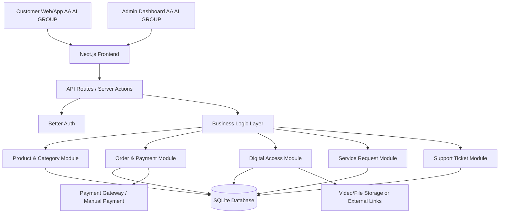
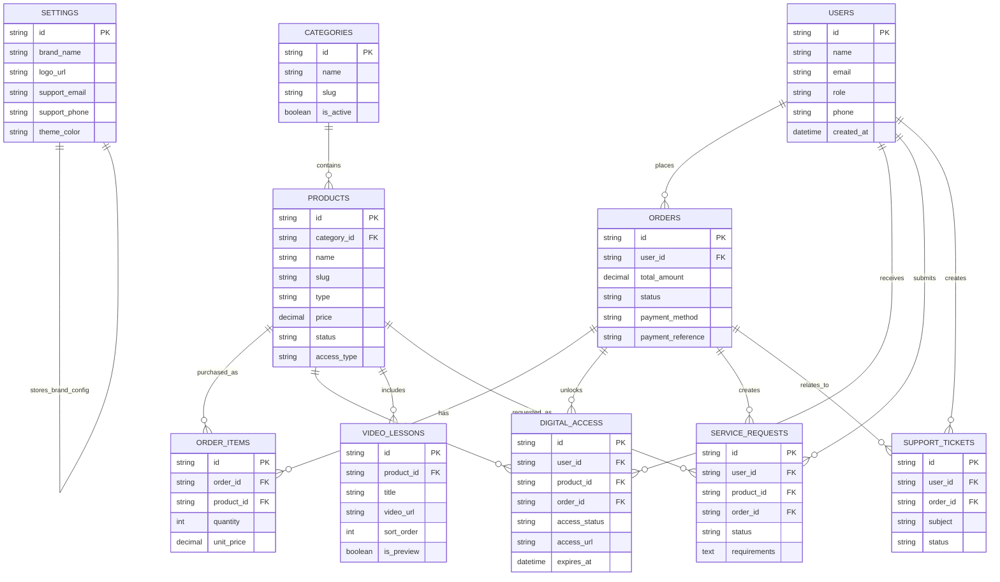

# PRD — Project Requirements Document

## 1. **Overview**

Projek ini ialah satu sistem web/aplikasi rasmi untuk bisnes digital bernama **AA AI GROUP**. Platform ini khas untuk menjual **app premium**, **video education AI**, dan **pelbagai servis digital** yang boleh ditambah dari semasa ke semasa. Sistem ini bertujuan menjadi platform utama AA AI GROUP untuk mempamerkan produk/servis, menerima pesanan, mengurus pelanggan, mengurus pembayaran, dan menyediakan akses kandungan digital kepada pembeli.

Matlamat utama aplikasi:

- Menjadikan **AA AI GROUP** sebagai platform rasmi untuk semua produk digital, video pendidikan, dan servis.
- Mengumpulkan app premium, video education AI, dan servis digital dalam satu website/aplikasi berjenama sendiri.
- Memudahkan pelanggan melihat katalog, membeli, dan mengakses produk selepas bayaran.
- Membolehkan pemilik bisnes menambah produk/servis baharu tanpa perlu ubah kod sistem.
- Menyediakan sistem akaun pelanggan, rekod pembelian, dan dashboard admin.
- Membina asas sistem yang boleh dikembangkan kepada mobile app pada masa depan.

## 2. **Requirements**

### Keperluan Pengguna Pelanggan

- Pelanggan boleh daftar akaun dan log masuk ke platform AA AI GROUP.
- Pelanggan boleh melihat senarai produk/servis mengikut kategori.
- Pelanggan boleh melihat detail produk seperti harga, penerangan, gambar/video preview, dan faedah produk.
- Pelanggan boleh membeli app premium, akses video education AI, atau servis digital.
- Pelanggan boleh melihat status pesanan dan sejarah pembelian.
- Pelanggan boleh mengakses kandungan digital selepas pembayaran berjaya.
- Pelanggan boleh menghubungi support AA AI GROUP jika ada isu berkaitan pembelian atau akses.

### Keperluan Admin/Pemilik Bisnes

- Admin boleh log masuk ke dashboard khas AA AI GROUP.
- Admin boleh tambah, edit, aktifkan, nyahaktifkan, dan padam produk/servis.
- Admin boleh susun produk mengikut kategori seperti App Premium, Video Education AI, Servis Digital, atau kategori baharu.
- Admin boleh melihat senarai pelanggan.
- Admin boleh melihat pesanan, status pembayaran, dan maklumat transaksi.
- Admin boleh memberi akses manual kepada pelanggan jika perlu.
- Admin boleh upload atau pautkan video pendidikan.
- Admin boleh mengurus status servis seperti pending, in progress, completed, atau cancelled.

### Keperluan Sistem

- Sistem mesti responsif untuk desktop dan telefon pintar.
- Sistem mesti mempunyai authentication yang selamat.
- Sistem mesti menyimpan data produk, pelanggan, pesanan, pembayaran, dan akses kandungan.
- Sistem mesti mudah dikembangkan untuk penambahan kategori/servis baharu.
- Sistem perlu menyokong produk digital yang berbeza jenis: app, video, dan servis.
- Sistem perlu mempunyai struktur role sekurang-kurangnya: `customer` dan `admin`.
- Sistem perlu menyediakan paparan dashboard yang mudah difahami.
- Sistem perlu memaparkan identiti jenama **AA AI GROUP** pada landing page, dashboard, invoice/resit, dan komunikasi pelanggan.

## 3. **Core Features**

- **Landing Page AA AI GROUP**
  - Paparan utama jenama AA AI GROUP, tawaran utama, testimoni, kategori produk, dan call-to-action untuk membeli atau daftar.

- **Katalog Produk & Servis**
  - Senarai semua app premium, video education AI, dan servis digital.
  - Penapis kategori dan carian produk.

- **Product Detail Page**
  - Maklumat lengkap produk/servis termasuk harga, gambar, video preview, kandungan yang diterima, dan cara akses.

- **Sistem Akaun Pelanggan**
  - Daftar, log masuk, profil pengguna, dan sejarah pembelian.

- **Checkout & Order Management**
  - Pelanggan boleh membuat pesanan dan sistem menyimpan status order.
  - Sokongan untuk status seperti pending, paid, failed, refunded, dan completed.

- **Akses Kandungan Digital**
  - Selepas pembelian berjaya, pelanggan boleh mengakses video, link download, license key, atau arahan servis melalui dashboard.

- **Video Education AI Library**
  - Modul khas untuk menyusun video pendidikan AI mengikut topik, modul, atau tahap pembelajaran.

- **Service Request Management**
  - Untuk servis digital, pelanggan boleh isi maklumat keperluan servis.
  - Admin boleh kemas kini status kerja servis.

- **Admin Dashboard AA AI GROUP**
  - Urus produk, kategori, pesanan, pelanggan, pembayaran, dan akses digital.

- **Content/Product Management**
  - Admin boleh tambah produk baharu tanpa perlu developer.
  - Produk boleh ditandakan sebagai app premium, video course, servis, bundle, atau produk lain.

- **Support / Ticket Ringkas**
  - Pelanggan boleh hantar pertanyaan berkaitan order atau akses.
  - Admin boleh semak dan balas isu pelanggan.

## 4. **User Flow**

### Flow Pelanggan Membeli Produk Digital

1. Pelanggan masuk ke website/aplikasi AA AI GROUP.
2. Pelanggan melihat landing page dan memilih kategori produk.
3. Pelanggan membuka halaman detail produk.
4. Pelanggan klik butang beli atau daftar dahulu.
5. Pelanggan log masuk atau cipta akaun baharu.
6. Pelanggan membuat pesanan.
7. Pelanggan membuat pembayaran atau menghantar bukti bayaran jika menggunakan pembayaran manual.
8. Sistem mengemas kini status order.
9. Jika pembayaran berjaya, sistem membuka akses produk digital.
10. Pelanggan melihat produk yang dibeli dalam dashboard pelanggan.

### Flow Pelanggan Membeli Servis

1. Pelanggan pilih servis yang ditawarkan oleh AA AI GROUP.
2. Pelanggan baca detail servis, harga, tempoh siap, dan syarat servis.
3. Pelanggan klik tempah servis.
4. Pelanggan isi maklumat projek/keperluan servis.
5. Pelanggan buat pembayaran atau submit permintaan quotation.
6. Admin menerima order servis.
7. Admin kemas kini status servis dari pending ke in progress dan completed.
8. Pelanggan menerima update melalui dashboard.

### Flow Admin Mengurus Produk

1. Admin log masuk ke dashboard AA AI GROUP.
2. Admin pilih menu produk.
3. Admin tambah produk baharu.
4. Admin pilih jenis produk: app premium, video education AI, servis, atau produk lain.
5. Admin masukkan nama, harga, penerangan, kategori, gambar, dan maklumat akses.
6. Admin publish produk.
7. Produk muncul di katalog pelanggan.

## 5. **Architecture**

Sistem dicadangkan sebagai aplikasi full-stack berasaskan web. Frontend digunakan oleh pelanggan dan admin, manakala backend mengurus authentication, produk, order, pembayaran, akses digital, dan data pelanggan. Database menyimpan semua maklumat utama bisnes AA AI GROUP.

### Komponen Utama Sistem

- **Customer Interface**: Halaman pelanggan untuk melihat produk, membeli, dan mengakses pembelian.
- **Admin Dashboard**: Panel pemilik bisnes untuk mengurus semua operasi AA AI GROUP.
- **Authentication**: Mengurus daftar masuk, log masuk, dan role pengguna.
- **Product Module**: Mengurus produk digital, video, servis, dan kategori.
- **Order Module**: Mengurus pesanan pelanggan dan status bayaran.
- **Digital Access Module**: Memberi akses produk selepas pembelian berjaya.
- **Service Module**: Mengurus permintaan servis dan progress kerja.
- **Support Module**: Mengurus pertanyaan pelanggan.
- **Branding Module**: Menyimpan tetapan asas jenama seperti nama AA AI GROUP, logo, warna tema, dan maklumat hubungan.
- **Database**: Menyimpan semua data pelanggan, produk, order, pembayaran, akses, dan tiket support.

## 6. **Database Schema**

### Jadual: `settings`

| Kolum           | Tipe        | Kegunaan                                 |
| --------------- | ----------- | ---------------------------------------- |
| `id`            | text / uuid | ID unik tetapan                          |
| `brand_name`    | text        | Nama rasmi platform, contoh: AA AI GROUP |
| `logo_url`      | text        | URL logo rasmi jenama                    |
| `support_email` | text        | Emel support rasmi                       |
| `support_phone` | text        | Nombor telefon/WhatsApp support          |
| `theme_color`   | text        | Warna tema utama website/aplikasi        |
| `updated_at`    | datetime    | Tarikh tetapan dikemas kini              |

### Jadual: `users`

| Kolum           | Tipe        | Kegunaan                                                             |
| --------------- | ----------- | -------------------------------------------------------------------- |
| `id`            | text / uuid | ID unik pengguna                                                     |
| `name`          | text        | Nama pengguna                                                        |
| `email`         | text        | Emel pengguna untuk log masuk                                        |
| `password_hash` | text        | Kata laluan yang telah dienkripsi jika diperlukan oleh auth provider |
| `role`          | text        | Peranan pengguna: customer atau admin                                |
| `phone`         | text        | Nombor telefon pelanggan, optional                                   |
| `created_at`    | datetime    | Tarikh akaun dicipta                                                 |
| `updated_at`    | datetime    | Tarikh akaun dikemas kini                                            |

### Jadual: `categories`

| Kolum         | Tipe        | Kegunaan                                                              |
| ------------- | ----------- | --------------------------------------------------------------------- |
| `id`          | text / uuid | ID unik kategori                                                      |
| `name`        | text        | Nama kategori seperti App Premium, Video Education AI, Servis Digital |
| `slug`        | text        | URL mesra pengguna untuk kategori                                     |
| `description` | text        | Penerangan ringkas kategori                                           |
| `is_active`   | boolean     | Status kategori aktif atau tidak                                      |
| `created_at`  | datetime    | Tarikh kategori dibuat                                                |

### Jadual: `products`

| Kolum               | Tipe        | Kegunaan                                                                 |
| ------------------- | ----------- | ------------------------------------------------------------------------ |
| `id`                | text / uuid | ID unik produk                                                           |
| `category_id`       | text / uuid | Hubungan kepada kategori                                                 |
| `name`              | text        | Nama produk/servis                                                       |
| `slug`              | text        | URL mesra pengguna untuk produk                                          |
| `type`              | text        | Jenis produk: app, video_course, service, bundle, other                  |
| `short_description` | text        | Penerangan ringkas                                                       |
| `description`       | text        | Penerangan penuh produk                                                  |
| `price`             | decimal     | Harga jualan                                                             |
| `compare_price`     | decimal     | Harga asal sebelum diskaun, optional                                     |
| `thumbnail_url`     | text        | URL gambar produk                                                        |
| `status`            | text        | draft, published, archived                                               |
| `access_type`       | text        | download_link, license_key, video_access, service_request, external_link |
| `access_value`      | text        | Link/file/key/arahan akses jika sesuai                                   |
| `created_at`        | datetime    | Tarikh produk dibuat                                                     |
| `updated_at`        | datetime    | Tarikh produk dikemas kini                                               |

### Jadual: `orders`

| Kolum               | Tipe        | Kegunaan                                                    |
| ------------------- | ----------- | ----------------------------------------------------------- |
| `id`                | text / uuid | ID unik pesanan                                             |
| `user_id`           | text / uuid | Pelanggan yang membuat pesanan                              |
| `total_amount`      | decimal     | Jumlah bayaran pesanan                                      |
| `status`            | text        | pending, paid, failed, refunded, completed, cancelled       |
| `payment_method`    | text        | Kaedah bayaran seperti manual_transfer atau payment_gateway |
| `payment_reference` | text        | Rujukan pembayaran                                          |
| `created_at`        | datetime    | Tarikh pesanan dibuat                                       |
| `updated_at`        | datetime    | Tarikh pesanan dikemas kini                                 |

### Jadual: `order_items`

| Kolum        | Tipe        | Kegunaan                        |
| ------------ | ----------- | ------------------------------- |
| `id`         | text / uuid | ID unik item pesanan            |
| `order_id`   | text / uuid | Hubungan kepada pesanan         |
| `product_id` | text / uuid | Produk yang dibeli              |
| `quantity`   | integer     | Kuantiti produk                 |
| `unit_price` | decimal     | Harga per unit ketika pembelian |
| `created_at` | datetime    | Tarikh item pesanan dibuat      |

### Jadual: `digital_access`

| Kolum           | Tipe        | Kegunaan                                      |
| --------------- | ----------- | --------------------------------------------- |
| `id`            | text / uuid | ID unik akses digital                         |
| `user_id`       | text / uuid | Pengguna yang diberi akses                    |
| `product_id`    | text / uuid | Produk yang boleh diakses                     |
| `order_id`      | text / uuid | Pesanan yang menyebabkan akses diberi         |
| `access_status` | text        | active, expired, revoked                      |
| `access_url`    | text        | Link akses, download, video, atau portal luar |
| `license_key`   | text        | License key jika produk memerlukan key        |
| `expires_at`    | datetime    | Tarikh luput akses jika ada                   |
| `created_at`    | datetime    | Tarikh akses diberikan                        |

### Jadual: `video_lessons`

| Kolum         | Tipe        | Kegunaan                                 |
| ------------- | ----------- | ---------------------------------------- |
| `id`          | text / uuid | ID unik video                            |
| `product_id`  | text / uuid | Course/produk video berkaitan            |
| `title`       | text        | Tajuk video                              |
| `description` | text        | Penerangan video                         |
| `video_url`   | text        | Link video hosted atau embed             |
| `sort_order`  | integer     | Susunan video dalam course               |
| `is_preview`  | boolean     | Sama ada video boleh ditonton tanpa beli |
| `created_at`  | datetime    | Tarikh video ditambah                    |

### Jadual: `service_requests`

| Kolum          | Tipe        | Kegunaan                                   |
| -------------- | ----------- | ------------------------------------------ |
| `id`           | text / uuid | ID unik permintaan servis                  |
| `user_id`      | text / uuid | Pelanggan yang meminta servis              |
| `product_id`   | text / uuid | Servis yang ditempah                       |
| `order_id`     | text / uuid | Pesanan berkaitan servis                   |
| `requirements` | text        | Maklumat keperluan pelanggan               |
| `status`       | text        | pending, in_progress, completed, cancelled |
| `admin_notes`  | text        | Nota dalaman admin                         |
| `created_at`   | datetime    | Tarikh permintaan dibuat                   |
| `updated_at`   | datetime    | Tarikh status dikemas kini                 |

### Jadual: `support_tickets`

| Kolum        | Tipe        | Kegunaan                    |
| ------------ | ----------- | --------------------------- |
| `id`         | text / uuid | ID unik tiket support       |
| `user_id`    | text / uuid | Pengguna yang membuka tiket |
| `order_id`   | text / uuid | Pesanan berkaitan, optional |
| `subject`    | text        | Tajuk isu                   |
| `message`    | text        | Mesej pelanggan             |
| `status`     | text        | open, replied, closed       |
| `created_at` | datetime    | Tarikh tiket dibuat         |
| `updated_at` | datetime    | Tarikh tiket dikemas kini   |

## 7. **Tech Stack**

Cadangan tech stack default untuk membina sistem full-stack yang moden, mudah dikembangkan, dan sesuai untuk MVP AA AI GROUP:

- **Frontend & Backend**: Next.js
  - Digunakan untuk membina website, dashboard admin, halaman pelanggan, dan API/server actions dalam satu projek.

- **UI Styling**: Tailwind CSS
  - Memudahkan reka bentuk responsif, moden, dan cepat dibangunkan.

- **UI Components**: shadcn/ui
  - Komponen siap guna seperti button, table, form, dialog, tabs, card, dan dashboard layout.

- **ORM / Database Layer**: Drizzle ORM
  - Mengurus schema database dan query dengan lebih tersusun.

- **Database**: SQLite untuk MVP
  - Sesuai untuk versi awal kerana mudah dipasang dan dikendalikan.
  - Boleh dinaik taraf ke PostgreSQL apabila trafik dan data semakin besar.

- **Authentication**: Better Auth
  - Untuk sistem daftar masuk, log masuk, session, dan role admin/customer.

- **File / Video Storage**:
  - Untuk MVP, video boleh disimpan melalui platform luar seperti YouTube unlisted, Vimeo, Cloudflare Stream, atau storage lain.
  - Link akses disimpan dalam database dan hanya dipaparkan kepada pembeli yang sah.

- **Payment Integration**:
  - Fasa awal boleh menyokong manual bank transfer dan upload bukti pembayaran.
  - Fasa seterusnya boleh integrasi payment gateway Malaysia seperti ToyyibPay, Billplz, Stripe, atau senangPay.

- **Deployment**:
  - NETLIFY untuk hosting aplikasi Next.js.
  - Database boleh bermula dengan SQLite managed/storage yang sesuai, kemudian migrate ke PostgreSQL jika perlu.

- **Future Mobile App Option**:
  - Selepas web stabil, sistem boleh dikembangkan kepada mobile app menggunakan React Native atau Expo dengan backend/database yang sama.
